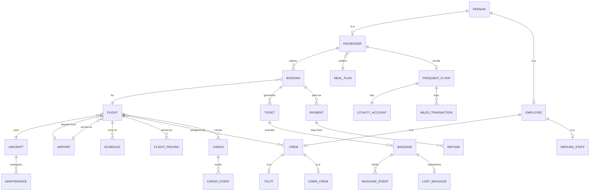

<p align="center">
  
</p>

<h1 align="center">
  ✈️ AeroNova — Airline Management System
</h1>

<p align="center">
  <em>A production-grade, full-stack airline management platform built with a relational database-first architecture.</em>
</p>

<p align="center">
  
  
  
  
  
  
  
  
  
  
</p>

<p align="center">
  <a href="#-features">Features</a> •
  <a href="#-architecture">Architecture</a> •
  <a href="#-database-schema">Database</a> •
  <a href="#-api-reference">API</a> •
  <a href="#-getting-started">Setup</a> •
  <a href="#-project-structure">Structure</a>
</p>

---

## 📋 Overview

**AeroNova** is a comprehensive airline management system built as a database-driven university project. It implements a complete flight operations platform — from passenger-facing booking and e-ticketing to administrative fleet management and revenue analytics — all backed by a **fully normalized MySQL 8.0 relational schema** with **25+ interconnected tables**, enforced foreign keys, and transactional integrity.

The system demonstrates real-world database concepts including:

- **ISA (Generalization/Specialization) hierarchies** — `Person → Employee → Crew → Pilot/CabinCrew`
- **Composite primary keys** — `flight_crew_assignment(FlightID, CrewID)`
- **Transactional atomicity** — Booking + Payment + Ticket generation in a single DB transaction
- **Concurrent seat locking** — Redis-backed distributed locks with in-memory fallback
- **Event sourcing patterns** — Baggage and Cargo timeline tracking via event tables

---

## 🌟 Features

### 🧳 Passenger Portal

| Feature | Description |
|---|---|
| **Flight Search** | Search domestic & international flights by origin/destination with airport autocomplete (FULLTEXT index) |
| **Interactive Seat Map** | 3D-styled seat selection rendered from aircraft `SeatLayout` JSON — Economy, Business, First Class cabins with aisle gaps |
| **Real-time Seat Locking** | Redis `SET NX EX` based distributed lock with 15-min TTL prevents double-booking during concurrent sessions |
| **Multi-Passenger Booking** | Book for multiple passengers with individual seat assignments in a single transaction |
| **PNR Generation** | Unique 6-character alphanumeric Passenger Name Records with collision detection (up to 10 retry attempts) |
| **Payment Processing** | Idempotency-key protected payment flow with automatic ticket + baggage record generation on success |
| **Digital Boarding Pass** | Dynamic HTML boarding pass with flight route, seat, cabin class, and baggage allowance — downloadable |
| **QR Code Tickets** | `qrcode.react` generated QR codes embedded on boarding pass cards |
| **Baggage Tracking** | Real-time tracking by tag number with full event timeline (check-in → loaded → in-transit → delivered) |
| **Lost Baggage Reports** | File lost baggage claims that update status and create audit trail events |
| **Cargo Shipping** | Book cargo shipments with automatic pricing (weight-based + hazmat/perishable surcharges) and payload validation |
| **Cargo Tracking** | Track shipments by tracking number with event timeline |
| **Loyalty Program** | Enroll in frequent flyer program with Silver → Gold → Platinum tier progression based on miles accrual |
| **Miles Earn & Redeem** | Earn miles with tier multipliers (1.0x/1.5x/2.0x), redeem at $1 per 100 miles |
| **Meal Preferences** | Choose from Halal (IFANCA certified), Vegetarian, or Kosher (OU certified) meal plans |
| **Profile Management** | Update personal info, passport number, avatar, and meal preferences |
| **Auth System** | JWT access tokens + HTTP-only cookie refresh tokens with rotation and revocation |

### 🛡️ Admin Dashboard

| Feature | Description |
|---|---|
| **KPI Overview** | Real-time cards: Total Revenue, Active Flights, Today's Passengers, System Alerts |
| **Revenue Analytics** | Monthly revenue aggregation with `DATE_FORMAT` grouped queries and Recharts visualization |
| **Load Factor Analysis** | Per-flight booking-to-capacity ratio calculation |
| **Flight Management** | Full CRUD for flights with status transitions (Scheduled → Boarding → Departed → Arrived / Cancelled / Delayed) |
| **Crew Scheduling** | Assign pilots and cabin crew to flights with aircraft rating validation |
| **Fleet Management** | Aircraft registry with maintenance scheduling (A-Check, C-Check, Engine Inspection) and status tracking |
| **Admin Auth Guards** | Role-based access control with `AdminGuard` component and `requireAdmin` middleware |

### ✨ UI/UX

| Feature | Description |
|---|---|
| **3D Globe Hero** | Three.js rendered rotating Earth with animated flight arc paths (great-circle curves) on the homepage |
| **Glassmorphism Design** | Dark theme with frosted glass cards, gradient borders, and backdrop blur effects |
| **Page Transitions** | Framer Motion `AnimatePresence` with opacity/translate/blur enter-exit animations |
| **Animated Starfield** | Canvas-rendered parallax starfield background effect |
| **Micro-Animations** | Hover tilts, counter animations, scroll reveals, and skeleton loading states |
| **Responsive Layout** | Full mobile-to-desktop responsiveness with Tailwind breakpoints |

---

## 🏗 Architecture

```
┌─────────────────────────────────────────────────────────────────────┐
│                          CLIENT (Browser)                           │
│                                                                     │
│  React 19 + TypeScript + Vite + Tailwind CSS + Framer Motion        │
│  ┌─────────┐ ┌──────────┐ ┌─────────┐ ┌────────┐ ┌─────────────┐  │
│  │ Zustand  │ │ TanStack │ │ Three.js│ │Recharts│ │  Lucide     │  │
│  │ (State)  │ │ (Query)  │ │ (Globe) │ │(Charts)│ │  (Icons)    │  │
│  └─────────┘ └──────────┘ └─────────┘ └────────┘ └─────────────┘  │
└──────────────────────────┬──────────────────────────────────────────┘
                           │ HTTPS / REST
                           ▼
┌─────────────────────────────────────────────────────────────────────┐
│                        API SERVER (Backend)                         │
│                                                                     │
│  Express.js + Helmet + CORS + Morgan + Cookie-Parser                │
│  ┌──────────┐ ┌─────────┐ ┌───────────┐ ┌─────────────────────┐   │
│  │ Zod      │ │ JWT +   │ │ bcryptjs  │ │ Sequelize ORM       │   │
│  │(Validate)│ │ Refresh │ │ (Hashing) │ │ (Models + Assocs)   │   │
│  └──────────┘ └─────────┘ └───────────┘ └──────────┬──────────┘   │
│                                                      │              │
│  ┌─────────────────────┐    ┌────────────────────────┼────────┐    │
│  │ SeatLockService     │◄──►│ Redis (ioredis)        │        │    │
│  │ (Distributed Locks) │    │ SET NX EX / GET / DEL  │        │    │
│  │ + Memory Fallback   │    └────────────────────────┘        │    │
│  └─────────────────────┘                                      │    │
└──────────────────────────────────────────────────┬────────────┘────┘
                                                   │
                                                   ▼
                                    ┌──────────────────────────┐
                                    │     MySQL 8.0 (InnoDB)   │
                                    │                          │
                                    │  25+ Tables              │
                                    │  Foreign Key Constraints │
                                    │  FULLTEXT Indexes        │
                                    │  JSON Columns            │
                                    │  Generated Columns       │
                                    │  CHECK Constraints       │
                                    │  ACID Transactions       │
                                    └──────────────────────────┘
```

---

## 🗄 Database Schema

The database implements a **normalized relational schema** with **25+ tables** connected by foreign keys. Full schema documentation with SQL `CREATE TABLE` statements, backend route mappings, frontend component usage, and mock seed data is available in [`TABLE_USAGE_MAP.md`](TABLE_USAGE_MAP.md).

### Entity-Relationship Overview



### Table Categories

| Category | Tables | Purpose |
|---|---|---|
| **People** | `person`, `passenger`, `employee`, `guest` | ISA hierarchy — Person is the supertype; Passenger and Employee are subtypes |
| **Crew** | `crew`, `pilot`, `cabin_crew`, `ground_staff` | Further specialization of Employee with role-specific attributes |
| **Flights** | `flight`, `schedule`, `flight_pricing`, `airport`, `aircraft` | Core flight operations with multi-cabin pricing and timezone-aware scheduling |
| **Bookings** | `booking`, `ticket`, `payment`, `refund` | Complete booking lifecycle from reservation through payment to ticketing |
| **Baggage** | `baggage`, `baggage_event`, `lost_baggage` | Event-sourced baggage tracking with lost report filing |
| **Cargo** | `cargo`, `cargo_event` | Freight logistics with weight/volume/hazmat classification |
| **Loyalty** | `frequent_flyer`, `loyalty_account`, `miles_transaction` | Tiered rewards program with earn/redeem transaction logging |
| **Operations** | `maintenance`, `flight_crew_assignment` | Fleet maintenance and crew-to-flight assignment (composite PK junction table) |
| **Auth** | `refresh_token`, `email_verification_token`, `password_reset_token`, `admin_users` | Security tokens with expiry and revocation support |
| **System** | `notification_log` | Audit trail for system notifications |

---

## 🔌 API Reference

Base URL: `http://localhost:3001/api/v1`

### Authentication
| Method | Endpoint | Description | Auth |
|---|---|---|---|
| `POST` | `/auth/register` | Register new passenger (Zod validated) | — |
| `POST` | `/auth/login` | Login → returns JWT access token + sets refresh cookie | — |
| `POST` | `/auth/refresh` | Rotate access token via HTTP-only refresh cookie | Cookie |
| `POST` | `/auth/logout` | Revoke refresh token and clear cookie | Cookie |
| `POST` | `/auth/verify-email` | Verify email with token | — |
| `POST` | `/auth/forgot-password` | Request password reset (anti-enumeration) | — |
| `POST` | `/auth/reset-password` | Reset password with token | — |

### Flights & Search
| Method | Endpoint | Description | Auth |
|---|---|---|---|
| `GET` | `/airports/search?q=` | FULLTEXT airport search (autocomplete) | — |
| `GET` | `/flights/search` | Search flights by route and date | — |
| `GET` | `/flights/:id` | Flight details with aircraft, airports, schedule | — |
| `GET` | `/flights/:id/seats` | Seat availability map from aircraft SeatLayout JSON | — |

### Booking & Payment
| Method | Endpoint | Description | Auth |
|---|---|---|---|
| `POST` | `/bookings` | Create booking with seat locking (Zod validated) | JWT |
| `GET` | `/bookings/:id` | Get booking details with flight info | — |
| `POST` | `/payments/process` | Process payment (idempotent) → generates tickets + baggage | JWT |
| `POST` | `/payments/:id/refund` | Process refund → cancels booking | JWT |

### Tickets & Tracking
| Method | Endpoint | Description | Auth |
|---|---|---|---|
| `GET` | `/tickets/:pnr` | Retrieve ticket by PNR with flight + passenger info | — |
| `GET` | `/tickets/:pnr/pdf` | Download HTML boarding pass | — |
| `GET` | `/baggage/:tag/track` | Track baggage with full event timeline | — |
| `POST` | `/baggage/lost-report` | File lost baggage report | — |

### Cargo
| Method | Endpoint | Description | Auth |
|---|---|---|---|
| `POST` | `/cargo/book` | Book cargo shipment with pricing | — |
| `GET` | `/cargo/:tracking_no/track` | Track cargo with event timeline | — |

### Loyalty Program
| Method | Endpoint | Description | Auth |
|---|---|---|---|
| `GET` | `/loyalty/account` | Get FF account + recent transactions | JWT |
| `GET` | `/loyalty/transactions` | Full transaction history | JWT |
| `POST` | `/loyalty/enroll` | Enroll in frequent flyer program | JWT |
| `POST` | `/loyalty/accrue` | Earn miles with tier multiplier | JWT |
| `POST` | `/loyalty/redeem` | Redeem miles for discount ($1 per 100 miles) | JWT |

### Admin Endpoints
| Method | Endpoint | Description | Auth |
|---|---|---|---|
| `GET` | `/admin/analytics/overview` | Dashboard KPIs (revenue, flights, alerts) | Admin |
| `GET` | `/admin/analytics/revenue` | Monthly revenue aggregation | Admin |
| `GET` | `/admin/analytics/load-factor` | Flight load factor analysis | Admin |
| `GET/POST/PUT` | `/admin/flights` | Flight CRUD operations | Admin |
| `GET/POST/PUT` | `/admin/crew` | Crew management | Admin |
| `GET/POST/PUT` | `/admin/fleet` | Fleet & maintenance management | Admin |
| `GET/PUT` | `/admin/settings` | System settings | Admin |

### System
| Method | Endpoint | Description |
|---|---|---|
| `GET` | `/api/health` | Health check (returns `{ status: 'ok' }`) |

---

## 🚀 Getting Started

### Prerequisites

| Software | Version | Purpose |
|---|---|---|
| [Node.js](https://nodejs.org/) | ≥ 18.0 | JavaScript runtime |
| [MySQL](https://www.mysql.com/) | ≥ 8.0 | Primary database |
| [Redis](https://redis.io/) | Any | Seat locking & caching (optional — falls back to in-memory) |

> **Note:** Redis is **optional**. The `SeatLockService` includes an automatic in-memory `Map()` fallback when Redis is unavailable, so the app runs fully without it.

### 1️⃣ Clone the Repository

```bash
git clone https://github.com/muhammad-abdullah-nova-dev/AeroNova.git
cd AeroNova
```

### 2️⃣ Database Setup

```sql
CREATE DATABASE axiom_airlines;
```

> Tables are **auto-created** by Sequelize `sync()` on first server start. No manual migration scripts needed.

### 3️⃣ Backend Setup

```bash
cd backend

# Install dependencies
npm install

# Configure environment
cp .env.example .env
```

Edit `backend/.env`:
```env
PORT=3001
NODE_ENV=development

# MySQL
DB_HOST=127.0.0.1
DB_USER=root
DB_PASSWORD=your_mysql_password
DB_NAME=axiom_airlines
DB_PORT=3306

# Auth
JWT_SECRET=your_super_secret_jwt_key_here
JWT_REFRESH_SECRET=your_super_secret_refresh_key_here

# Frontend Origin
ALLOWED_ORIGINS=http://localhost:5173

# Redis (optional)
REDIS_URL=redis://localhost:6379
```

```bash
# Seed the database with sample data (airports, aircraft, flights, crew, etc.)
npm run seed

# Start the dev server (auto-restart on file changes)
npm run dev
```

The server will start at `http://localhost:3001`. You should see:
```
✅ MySQL connected
✅ Tables synced
✅ Schema migrations applied
🚀 Server running on port 3001
```

### 4️⃣ Frontend Setup

```bash
cd frontend

# Install dependencies
npm install

# Configure environment
cp .env.example .env
```

`frontend/.env` should contain:
```env
VITE_API_URL=http://localhost:3001/api/v1
```

```bash
# Start the Vite dev server
npm run dev
```

Open **http://localhost:5173** in your browser.

---

## 📂 Project Structure

```
AeroNova/
│
├── backend/                          # Express.js REST API
│   ├── src/
│   │   ├── config/
│   │   │   ├── database.js           # Sequelize MySQL connection with pool config
│   │   │   └── redis.js              # ioredis connection with graceful fallback
│   │   │
│   │   ├── middleware/
│   │   │   ├── auth.js               # JWT verification middleware
│   │   │   └── admin.js              # Admin role-based access control
│   │   │
│   │   ├── models/                   # 25+ Sequelize model definitions
│   │   │   ├── index.js              # Model registry + all associations
│   │   │   ├── person.js             # Supertype entity
│   │   │   ├── passenger.js          # ISA subtype of Person
│   │   │   ├── employee.js           # ISA subtype of Person
│   │   │   ├── crew.js               # ISA subtype of Employee
│   │   │   ├── pilot.js              # ISA subtype of Crew
│   │   │   ├── cabin_crew.js         # ISA subtype of Crew
│   │   │   ├── ground_staff.js       # ISA subtype of Employee
│   │   │   ├── flight.js             # Core flight entity
│   │   │   ├── flight_pricing.js     # Per-cabin pricing (composite unique)
│   │   │   ├── aircraft.js           # Fleet with JSON SeatLayout
│   │   │   ├── booking.js            # Reservation with JSON passengers
│   │   │   ├── ticket.js             # Generated on payment
│   │   │   ├── baggage.js            # Linked to ticket
│   │   │   ├── baggage_event.js      # Event timeline
│   │   │   ├── cargo.js              # Freight shipments
│   │   │   ├── cargo_event.js        # Cargo timeline
│   │   │   ├── loyalty_account.js    # Tier-based rewards
│   │   │   ├── miles_transaction.js  # Earn/Redeem audit log
│   │   │   └── ...                   # 8 more models
│   │   │
│   │   ├── routes/
│   │   │   ├── auth.js               # Register, Login, Refresh, Logout, Reset
│   │   │   ├── flights.js            # Search, Details, Seat Map
│   │   │   ├── bookings.js           # Create + Retrieve
│   │   │   ├── payments.js           # Process + Refund (transactional)
│   │   │   ├── tickets.js            # PNR lookup + PDF boarding pass
│   │   │   ├── baggage.js            # Track + Lost report
│   │   │   ├── cargo.js              # Book + Track
│   │   │   ├── loyalty.js            # Enroll, Accrue, Redeem
│   │   │   └── admin/                # Protected admin endpoints
│   │   │       ├── analytics.js      # Revenue, Load factor, KPIs
│   │   │       ├── flights.js        # Flight CRUD
│   │   │       ├── crew.js           # Crew management
│   │   │       ├── fleet.js          # Aircraft + Maintenance
│   │   │       └── settings.js       # System config
│   │   │
│   │   ├── schemas/
│   │   │   └── flight.js             # Zod validation schemas
│   │   │
│   │   ├── services/
│   │   │   ├── booking_service.js    # Booking logic + PNR generation
│   │   │   ├── flight_service.js     # Flight search queries
│   │   │   └── seat_lock_service.js  # Redis/Memory distributed lock
│   │   │
│   │   ├── utils/
│   │   │   ├── auth.js               # JWT sign/verify helpers
│   │   │   ├── password.js           # bcrypt hash/compare
│   │   │   └── pnr_generator.js      # Alphanumeric PNR generation
│   │   │
│   │   ├── workers/                  # Background task processors
│   │   │   ├── email_worker.js       # Email notification queue
│   │   │   ├── loyalty_worker.js     # Miles accrual processor
│   │   │   └── pdf_worker.js         # PDF generation queue
│   │   │
│   │   ├── index.js                  # Express server entry + schema migrations
│   │   └── seed.js                   # Database seeder script
│   │
│   ├── .env.example
│   └── package.json
│
├── frontend/                         # React + Vite + TypeScript
│   ├── src/
│   │   ├── components/
│   │   │   ├── admin/                # AdminLayout, Sidebar, KPICard, RevenueChart
│   │   │   ├── auth/                 # AuthGuard, AdminGuard, LoginForm, RegisterForm
│   │   │   ├── booking/              # BookingSummary, PNRConfirmation
│   │   │   ├── cargo/                # CargoBookingForm, ShipmentTracker
│   │   │   ├── effects/              # GlobeHero (Three.js), AppBackground, Starfield
│   │   │   ├── flights/              # FlightCard, SeatMap (interactive 3D-styled)
│   │   │   ├── layout/               # Navbar, Footer
│   │   │   ├── payment/              # CheckoutForm, PaymentOverlay
│   │   │   ├── search/               # AirportAutocomplete, FlightSearchBar
│   │   │   ├── ticket/               # BoardingPassCard
│   │   │   └── ui/                   # Badge, Button, Skeleton (design system)
│   │   │
│   │   ├── pages/
│   │   │   ├── HomePage.tsx          # Hero + Globe + Search bar
│   │   │   ├── FlightSearchPage.tsx  # Search results with FlightCards
│   │   │   ├── FlightDetailPage.tsx  # Flight info + Seat map
│   │   │   ├── BookingPage.tsx       # Multi-passenger booking flow
│   │   │   ├── BookingConfirmPage.tsx # PNR confirmation + payment
│   │   │   ├── TicketPage.tsx        # Digital boarding pass
│   │   │   ├── DashboardPage.tsx     # User dashboard (bookings, profile, tickets)
│   │   │   ├── BaggageTrackerPage.tsx# Baggage tracking + lost report
│   │   │   ├── CargoPage.tsx         # Cargo booking
│   │   │   ├── CargoTrackingPage.tsx # Cargo tracking timeline
│   │   │   ├── LoyaltyPage.tsx       # FF account, tiers, transactions
│   │   │   ├── InfoPages.tsx         # Help, FAQ, Policies, Legal
│   │   │   └── admin/                # Admin dashboard, flights, crew, fleet, settings
│   │   │
│   │   ├── lib/
│   │   │   ├── api/                  # Axios client + typed API functions
│   │   │   ├── hooks/                # useAnimatedCounter, useCardTilt, useScrollReveal
│   │   │   ├── stores/               # Zustand auth + booking stores
│   │   │   └── utils/                # Shared utility functions
│   │   │
│   │   ├── types/                    # TypeScript type definitions
│   │   ├── main.tsx                  # Application entry point
│   │   └── index.css                 # Tailwind directives + custom design tokens
│   │
│   ├── .env.example
│   ├── tailwind.config.js
│   ├── vite.config.ts
│   └── package.json
│
├── TABLE_USAGE_MAP.md                # 1500+ line comprehensive DB schema documentation
├── .gitignore                        # Excludes node_modules, .env, dist, IDE configs
└── README.md                         # ← You are here
```

---

## 🔐 Security Implementation

| Layer | Implementation |
|---|---|
| **Password Hashing** | `bcryptjs` with configurable salt rounds |
| **Access Tokens** | Short-lived JWT (15 min) with `PersonID`, `Email`, `IsAdmin` claims |
| **Refresh Tokens** | Long-lived (7 days) stored in HTTP-only, Secure, SameSite=Strict cookies |
| **Token Rotation** | New access tokens issued via `/auth/refresh` without re-login |
| **Token Revocation** | Refresh tokens tracked in DB with `Revoked` flag; cleared on logout |
| **Input Validation** | Zod schemas enforce types, formats, and constraints at the API boundary |
| **HTTP Headers** | Helmet.js sets security headers (CSP, HSTS, X-Frame-Options, etc.) |
| **CORS** | Configurable `ALLOWED_ORIGINS` whitelist |
| **Rate Limiting** | `express-rate-limit` protects auth endpoints |
| **Anti-Enumeration** | Forgot-password returns success regardless of email existence |
| **Idempotency** | Payment processing uses idempotency keys to prevent double-charges |
| **SQL Injection** | Sequelize parameterized queries — no raw string interpolation |

---

## 🎨 Design System

The frontend uses a custom dark-mode design system built on Tailwind CSS with extended tokens:

| Token | Value | Usage |
|---|---|---|
| `surface-dark` | `#0a0e1a` | Page background |
| `surface-card` | `rgba(15,23,42,0.6)` | Card backgrounds with glassmorphism |
| `accent-primary` | `#0ea5e9` | Primary actions, links |
| `accent-secondary` | `#6366f1` | Gradients, secondary accents |
| `seat-available` | `#22c55e` | Available seats on seat map |
| `seat-selected` | `#2563eb` | User-selected seats |
| `seat-occupied` | `#64748b` | Booked seats |
| `seat-premium` | `#eab308` | Premium/upgrade seats |
| `first` | `#f59e0b` | First Class cabin indicator |
| `business` | `#8b5cf6` | Business Class cabin indicator |
| `economy` | `#0ea5e9` | Economy Class cabin indicator |

---

## 🧪 Seeded Test Data

Running `npm run seed` populates the database with realistic interconnected data:

| Entity | Records | Details |
|---|---|---|
| **Persons** | 15 | 5 passengers + 10 employees (Pakistani, British, Saudi, Spanish nationalities) |
| **Passengers** | 5 | With passport numbers, meal preferences, and hashed passwords |
| **Employees** | 10 | Across Flight Ops, Cabin Services, and Ground Operations |
| **Crew** | 8 | 4 pilots (with aircraft ratings & flight hours) + 4 cabin crew (with service ratings & languages) |
| **Ground Staff** | 2 | Morning and Evening shifts at Terminal T1 |
| **Airports** | 10 | KHI, LHE, ISB, DXB, LHR, JFK, CDG, DOH, SIN, PEW — with timezone data |
| **Aircraft** | 5 | B777-300ER, A320neo, B737 MAX 8, A380-800, ATR 72-600 — with JSON seat layouts |
| **Flights** | 8 | Domestic (KHI↔LHE, KHI→PEW) and International (KHI→DXB/LHR/JFK/DOH/SIN) |
| **Flight Pricing** | 13 | Economy, Business, First Class prices per flight |
| **Schedules** | 6 | Daily and Weekly frequencies with timezone-aware times |
| **Meal Plans** | 3 | Halal (IFANCA), Vegetarian, Kosher (OU) — with certification info |
| **Crew Assignments** | 14 | Pilot + cabin crew per flight via junction table |
| **Maintenance** | 4 | A-Check, C-Check, Engine Inspection records |

---

## 👨‍💻 Author

**Muhammad Abdullah**
- GitHub: [@muhammad-abdullah-nova-dev](https://github.com/muhammad-abdullah-nova-dev)

---

## 📄 License

This project is developed as an academic/university database project. All rights reserved.

---

<p align="center">
  <sub>Built with ☕ and SQL queries — AeroNova Airline Management System</sub>
</p>
